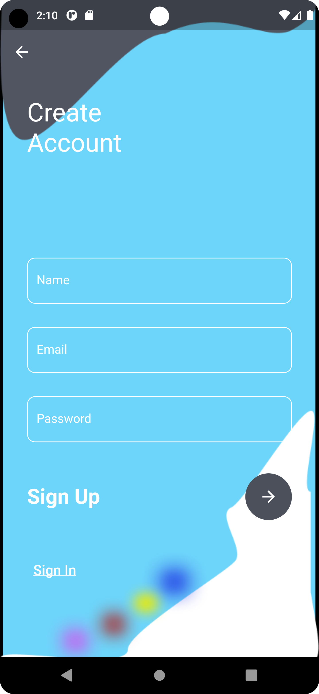

# Beautiful Login Page In Flutter With Reminder-Me Functionality

Create a login and signup page With Reminder-Me in flutter.

This amazing app is provided in open source. So, helpful contributions are highly appreciated.

## ScreenShots

|  |   |

---

### :heart: Found this project useful?

If you found this project useful, then please consider giving it a :star: on Github and sharing it with your friends via social media.

---

## Project Created & Maintained By

### Anurag Anand

## Getting Started

This project is a starting point for a Flutter application.

- clone repo and setup dart plugin

